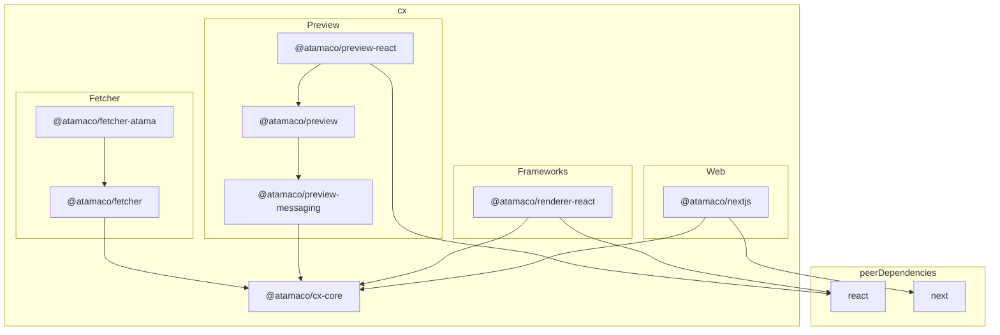

# CX Framework (Customer Experience)

This is a mono-repo containing packages to integrate Composer Core into different platforms and frameworks.

## Requirements

* Node >v17.6.0

## Setup

### Publishing packages

Packages are published with Github Actions to the Github Private Registry. We are using [changesets](https://github.com/changesets/changesets) for release automation. When making a change please run `npm run changeset` and include the relevant information and commit the created `.changeset/*.md` file alongside your changes.

## Package dependencies

